# Image classification using Edge Impulse and BalenaCloud

This guide will help you deploy an image classification system running on a Raspberry Pi. [Edge Impulse](https://edgeimpulse.com) enables developers to create intelligent device solutions with embedded Machine Learning. You will learn how to easily acquire image samples using your smartphone, train your ML algorithm and deploy the inference engine on your device. [BalenaCloud](https://balena.io) is a container-based platform for deploying IoT applications.

## Overview

This project is based on the great [BalenaCam project](https://github.com/balenalabs/balena-cam) to live stream your camera's feed by running a webapp in a container. For our application we leverage the multi-containers feature of Balena by adding a second container running Edge Impulse webassembly inference engine inside a Node.js server. The 2 containers communicate with each other through a websocket. The `balena-cam` webapp has been modified to call the inference engine every second and display the results on the webpage.

## Requirements

* Raspberry Pi (v3 and v4 tested)
* balenaFin (v1.0 tested)
* [Raspberry Pi camera](https://www.raspberrypi.org/products/camera-module-v2/)
* A mobile phone to capture image samples; or a collection of jpg files as an alternative
* Sign up for a free [Edge Impulse account](https://edgeimpulse.com/)
* Sign up for a free [BalenaCloud account](https://www.balena.io/)

## Creating your Edge Impulse project

In this tutorial we'll build a model that can distinguish between different type of shoes: flip flops, sneakers or running shoes. 

### Data collection

> _Note_: if you don't have a smartphone or already have a dataset of jpg files, you can use the [Edge Impulse Uploader](https://docs.edgeimpulse.com/docs/cli-uploader) to add images to your project.

Head to your Edge Impulse project and add your mobile phone as a device to start capturing images:

Scan the QR code with your phone and then go the *Data Acquisition* section.

You should capture around 30 to 50 images of each object you wish to classify. Make sure to capture with a variety of angles and zoom levels to get some diversity in the dataset.
Capture also 50 random images that are not objects you wish to classify.

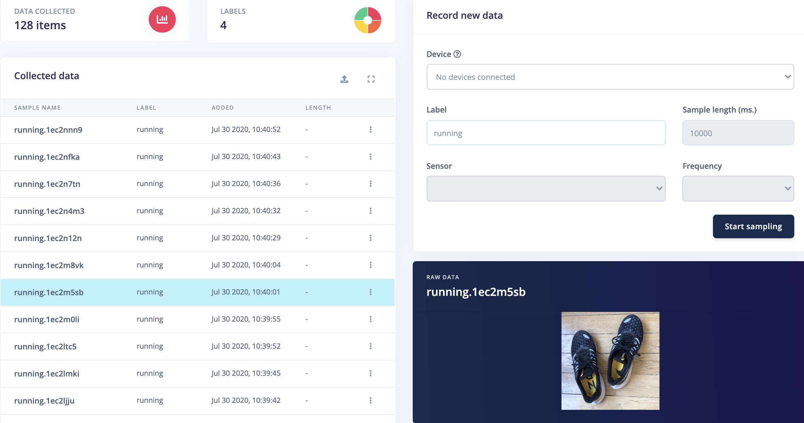

You will also need to get some testing data to validate the image classification model. You can switch between training and testing data  above the *Collected data* widget:

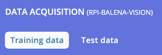

A good proportion is to have a training/testing ratio of 80/20. In this example we have 32 samples in training data and 8 samples in testing data per label. If you have captured all your samples in *Training data*, you can move them to the *Test data* by clicking on the 3-dots link on each sample line.

For more details you can follow our tutorial on [Collecting image data with your phone](https://docs.edgeimpulse.com/docs/image-classification-mobile-phone)

### Impulse design

Head to the *Impulse design* section and add the *Image* and *Transfer Learning* blocks to perform image classification:

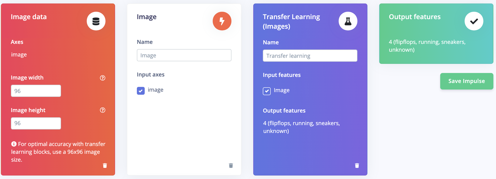

Select the *Image* section and confirm *RGB* color depth. Image features will then be generated.

Finally configure the Neural Network in the *Transfer learning* section with the following parameters:
* Number of training cycles: 100
* Learning rate: 0.001
* Data augmentation: ON
* Minimum confidence rating: 0.75

Depending on the complexity of your dataset you may need to tune those values.

Start the Neural Network training and check that performances are correct:

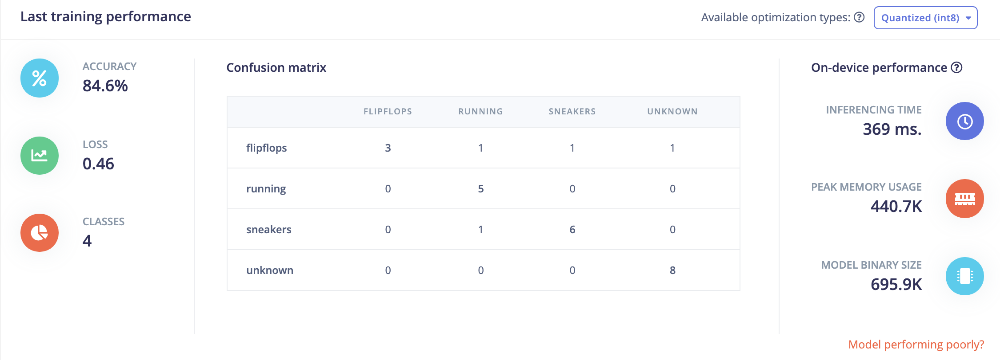

### Model testing

Before deploying our model, let's validate our current model using our Test data. Head to the *Model testing* section and classify all samples:

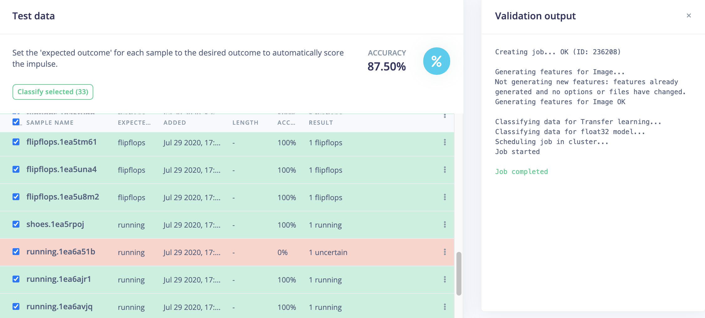

If you are satisfied with the accuracy it's time to build the library.

### Deployment

Head to the *Deployment* section and select the WebAssembly library:

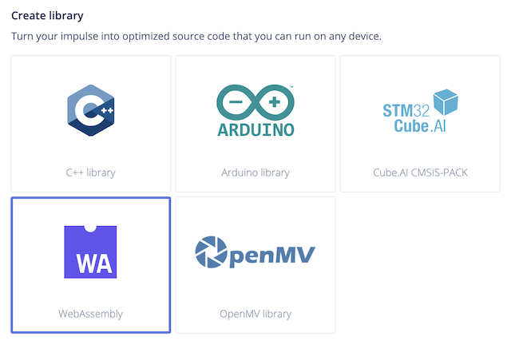

Select the *Quantized* version of the library and click on *Build*:

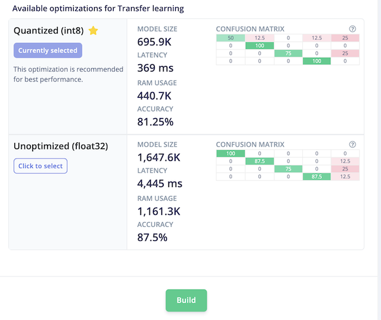

You can download the WebAssembly on your computer though the library will be automatically imported on the Raspberry using Edge Impulse API.

## Creating your BalenaCloud project

Click on the following link to deploy the application to your Balena account:

Once your application has been deployed, click on *Service variable* and add the two following variables to the *edgeimpulse-inference* service:
* EI_API_KEY
* EI_PROJECT_ID

You can get the Project ID value in your Edge Impulse's project dashboard. The API Key is in the *Keys* subsection of the dashboard. Make sure to copy the whole API Key value (68 characters long).

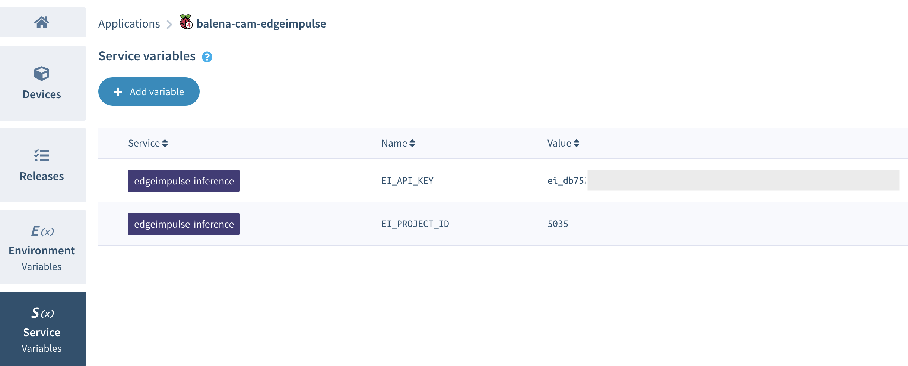

Finally select the *Devices* section and add your device. Select the *Development* version if you wish to run local tests easily. Don't forget to fill up your wifi network credentials if needed:

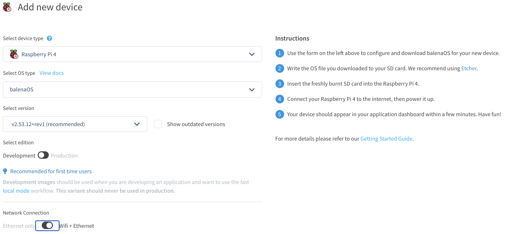

Follow the instructions to copy the Balena OS to the SD card of your device.
Turn on the Raspberry and your device should appear in the Balena dashboard and reboot to load containers. You should see containers' logs as below:

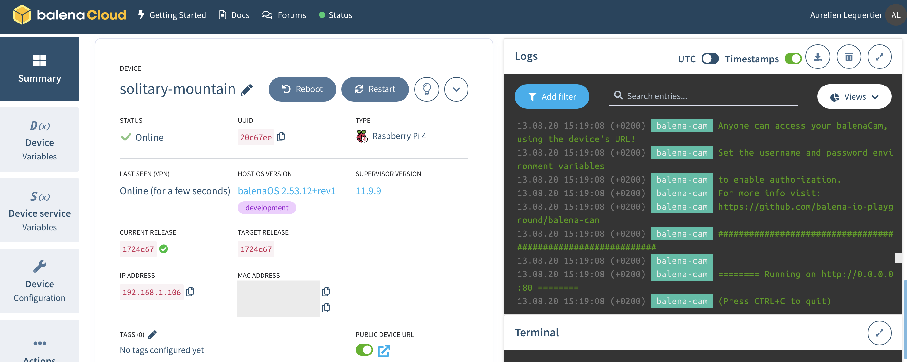

## Testing our classifier

Open your web browser and enter your device's local IP. You can also enable public URL as shown in the screenshot above.

The camera feed should be displayed on the webpage. If you notice slow framerate, probably your web browser doesn't support WebRTC and your client has switched to MJPEG. You can check next section to debug WebRTC.

Try to move different objects in front of the camera and see how well the classifier works! Predictions are displayed for all labels with values between 0 and 1, 1 being perfect prediction:

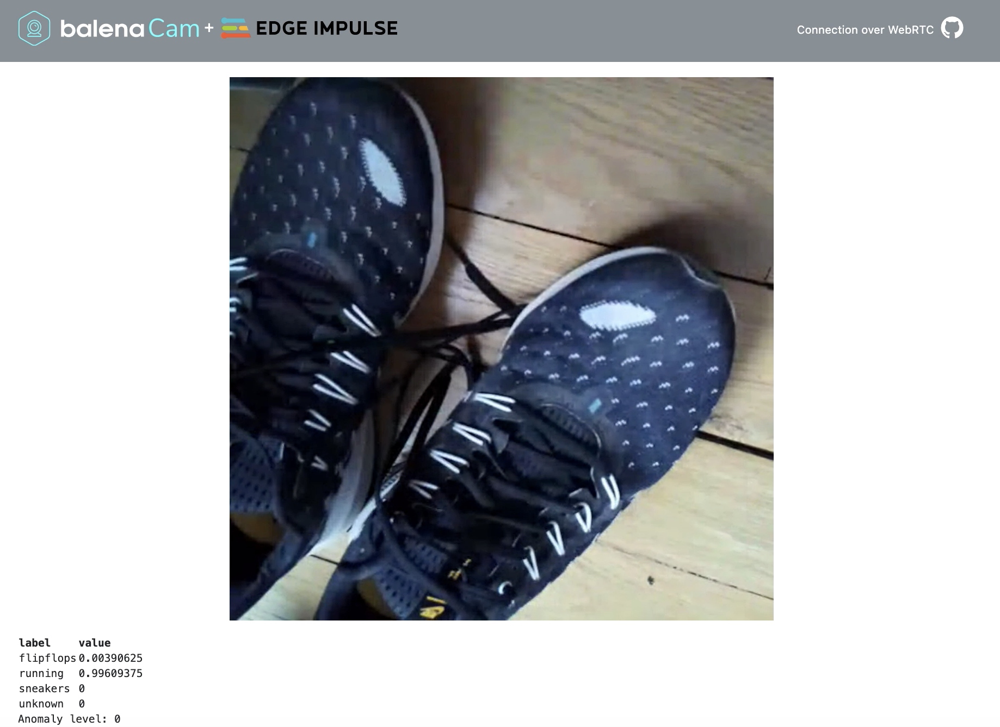

## Additional Information

- This project uses [WebRTC](https://webrtc.org/) (a Real-Time Communication protocol).
- A direct WebRTC connection fails in some cases.
- This current version uses mjpeg streaming when the webRTC connection fails.
- Chrome browsers will hide the local IP address from WebRTC, making the page appear but no camera view. To resolve this try the following
  - Navigate to chrome://flags/#enable-webrtc-hide-local-ips-with-mdns and set it to Disabled
  - You will need to relaunch Chrome after altering the setting
- Firefox may also hide local IP address from WebRTC, confirm following in 'config:about'
  - media.peerconnection.enabled: true
  - media.peerconnection.ice.obfuscate_host_addresses: false

If you wish to test the app in Balena local mode, you'll need to add your Edge Impulse Project ID and API Key in `edgeimpulse-inference/app/downloadWasm.sh`.

BalenaCam advanced options are available in [this guide](BALENA-OPTIONS.md).

## BalenaCam supported browsers

- **Chrome** (but see note above)
- **Firefox** (but see note above)
- **Safari**
- **Edge** (only mjpeg stream)
